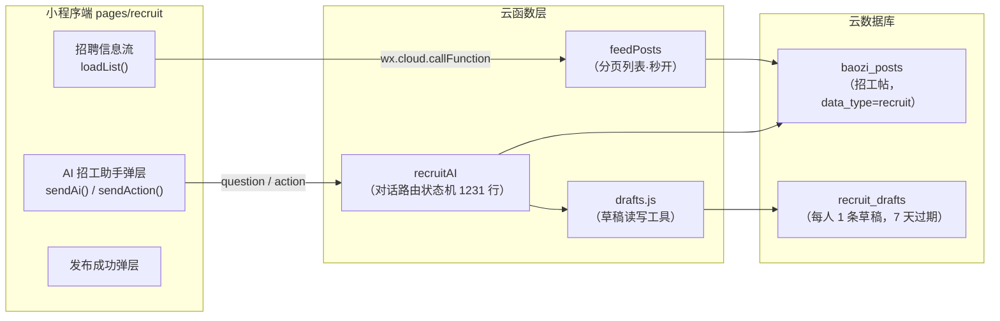
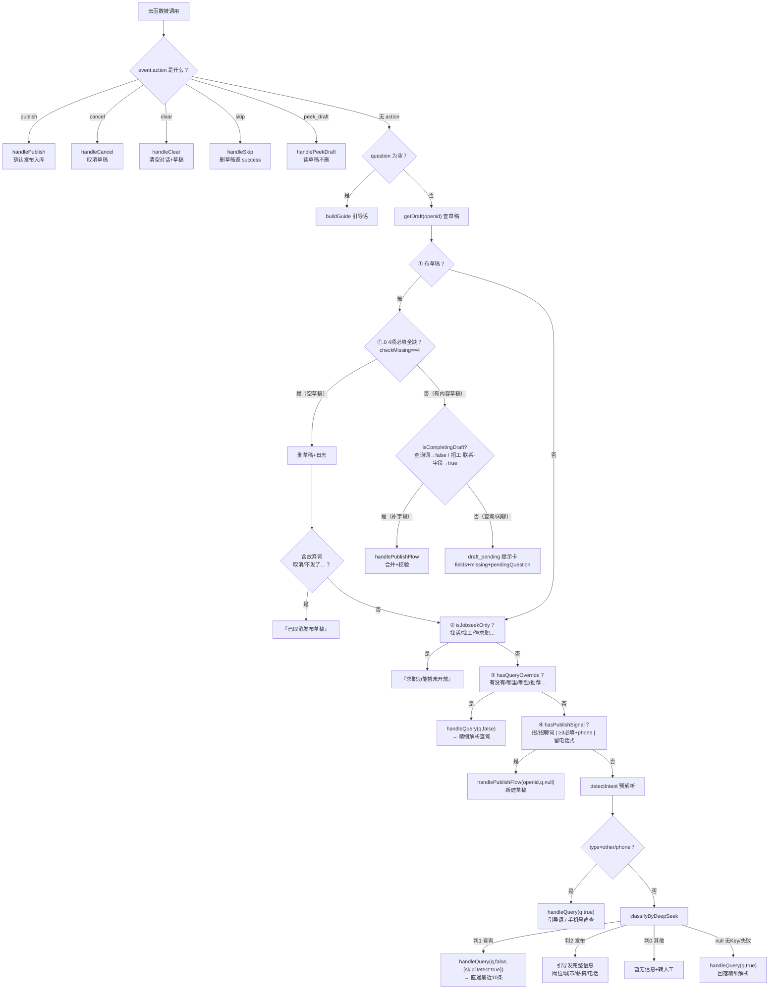
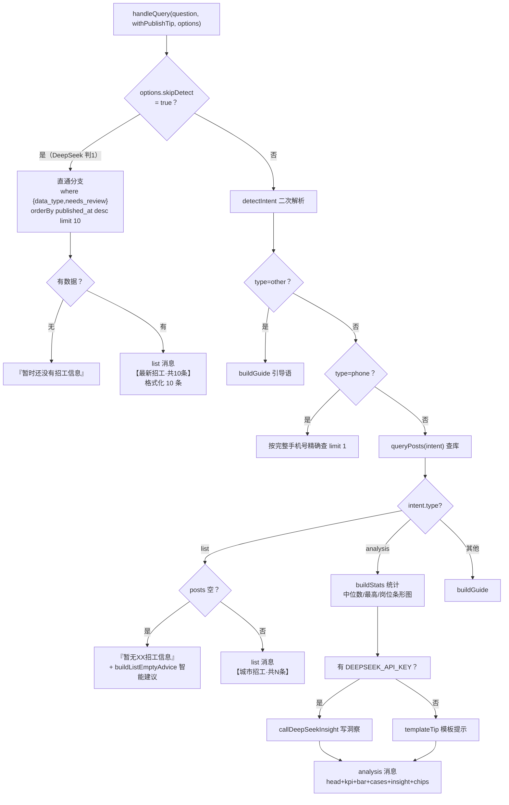
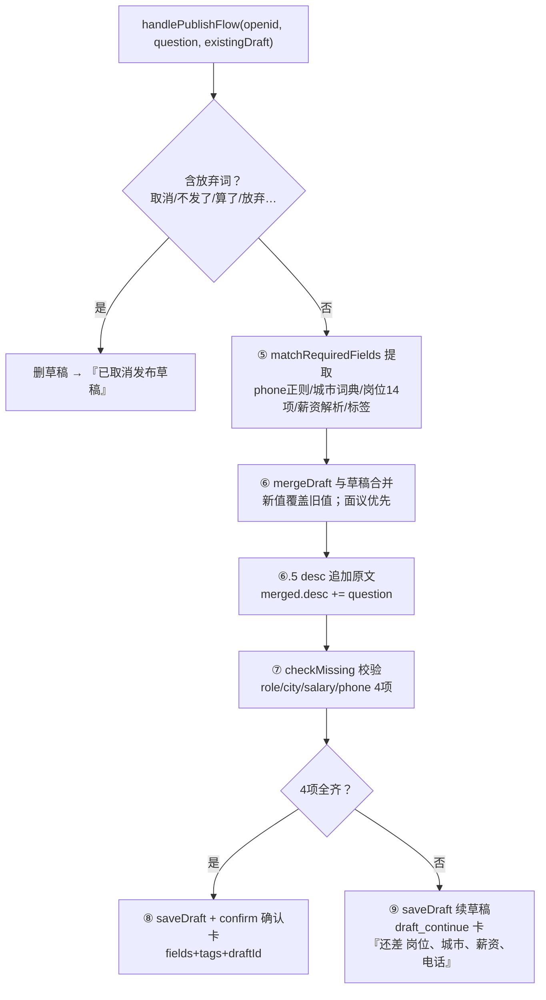

# 招工模块流程图（recruitAI + feedPosts）

> 生成时间：2026-08-25
> 代码基准：`cloudfunctions/recruitAI/index.js`（1231 行）、`cloudfunctions/recruitAI/drafts.js`、`cloudfunctions/feedPosts/index.js`、`miniprogram/pages/recruit/*`

---

## 一、模块总览（架构图）



**模块清单表**

| 文件 | 职责 | 关键点 |
|---|---|---|
| `recruitAI/index.js` | 对话路由状态机 + 查询 + 发布 + 分析 | 1231 行，核心 |
| `recruitAI/drafts.js` | 草稿 CRUD | openid 隔离、7 天过期、只存完整 phone |
| `recruitAI/cityCodes.js` | 全国市/省词典 | 490+ 市，逐字精确匹配 |
| `feedPosts/index.js` | 列表分页 | 只查库、无 AI、秒开 |
| `recruit.js` | 前端逻辑 | 列表 + AI 弹层 + 卡片渲染 |
| `recruit.wxml` | 前端模板 | list/analysis/card 三类消息渲染 |

---

## 二、recruitAI 主路由状态机（入口）



**主路由四道关卡当前词表（已确认非空）**

| 关卡 | 常量 | 当前实际内容 | 命中后果 |
|---|---|---|---|
| ① 草稿 | — | `getDraft` 按 openid | 空草稿自动删 / 有内容草稿分流 |
| ② 求职 | `JOBSEEK_KEYWORDS` | 找活/找工作/求职/我是师傅/待业… | "求职功能暂未开放" |
| ③ 查询 override | `QUERY_OVERRIDE_KEYWORDS` | 有没有/哪里有/谁家/推荐/附近/查一下/搜一下/哪些/在哪/哪里（9 词） | 走 `handleQuery` 精细解析 |
| ④ 发布信号 | `PUBLISH_KEYWORDS`+`RECRUIT_KEYWORDS` | 招/招聘/招工/招人/请人/雇/招师傅/招阿姨/招学徒 + 我要发/帮我发/我要招/发布/发个/发一条/发个招工 | 走发布流 |

---

## 三、查询流 `handleQuery` 内部（L445-543）



**detectIntent 解析出的字段（查询条件）**

| 字段 | 来源 | 示例 |
|---|---|---|
| `type` | analysisKw 命中 → analysis，否则 list | "工资多少" → analysis |
| `city/cityCode` | CITIES 词典先市后省 | "上海" → 上海 |
| `role` | ROLE_OPTIONS 14 项精确 | "大师傅/夫妻工/售卖员…" |
| `salaryMin/Max` | parseSalary 7 级解析 | "6000以上" → min=6000 |
| `wantPhone` | 电话/联系/找老板 | 列表电话置顶 |
| `limit` | "N条" | 默认 10，上限 20 |
| `timeRange` | 今天/近N天/本周/最近 | published_at ≥ 下限 |
| `keyword` | extractKeyword 模糊词 | "包吃住" |

**queryPosts 的 where 组装（L883-940）**

| 条件 | 写法 | 备注 |
|---|---|---|
| 类型 | `data_type: "recruit"` | 固定 |
| 审核 | `needs_review: neq(true)` | 不展示待审 |
| 岗位 | `role = intent.role` | 仅 14 项命中才加 |
| 薪资 | `salary_high = and(gte, lte)` | 区间必须 and 合并 |
| 时间 | `published_at ≥ startMs` | 数字时间戳 |
| 区域 | `or(city_code, district_code, city正则)` | 省级用 province_code |
| 模糊 | `or(raw_text/tags/address 正则)` | keyword 2-12 字 |

---

## 四、发布模式 `handlePublishFlow`（⑤⑥⑦⑧⑨，L171-207）



**发布全流程状态机（含前端按钮）**

| 阶段 | 卡片 | 前端按钮 | 触发 action |
|---|---|---|---|
| 建/续草稿 | `draft_continue`（还差 N 项） | 需查询？点我查信息 | `cancel`（删草稿回查询） |
| 草稿提示 | `draft_pending`（有草稿拦截） | 继续补充 / 跳过草稿 | `skip`（删草稿） |
| 信息齐 | `confirm`（确认招工信息） | ✅确认发布 / 取消 | `publish` / `cancel` |
| 发布成功 | 前端弹层 publishDone | 再发一条 / 查看列表 | — |

**handlePublish 入库字段（publishToBaoziPosts）**

```javascript
{
  data_type: "recruit", role, city, province, district,
  province_code, city_code, district_code, address,
  raw_text: d.desc,          // 用户全部原文
  phone, phone_masked,       // 完整号 + 脱敏号并存
  published_at: Date.now(),
  source: "user", needs_review: false,
  tags, salary_low/high 或 salary_note: "面议"
}
```

---

## 五、action 路由表（前端按钮专用通道）

| action | 云函数处理 | 返回 | 前端触发点 |
|---|---|---|---|
| `publish` | handlePublish：校验→入库→删草稿 | `{success, postId, summary}` | confirm 卡"确认发布" |
| `cancel` | handleCancel：删草稿 | `已取消发布草稿` | confirm 卡"取消" / 续卡"需查询" |
| `clear` | handleClear：删草稿+清空 | `{cleared, hadDraft}` | 顶部"清空"按钮 |
| `skip` | handleSkip：删草稿 | `{success, hidden}` | draft_pending 卡"跳过草稿" |
| `peek_draft` | handlePeekDraft：只读不删 | `{hasDraft, fields, missing}` | 弹层打开时主动查询 |

---

## 六、前端消息渲染映射（msgType → wxml）

| msgType / cardType | 数据 | 渲染方式 | 交互 |
|---|---|---|---|
| `text` | reply + tipChip | 打字机逐字 | tipChip 可点击重发 |
| `list` | reply + data[] | 卡片列表（秒开不打字） | 触底无 |
| `analysis` | reply + blocks[] | KPI/条形图/案例/洞察/芯片 | 案例默认折叠前 3 条，可展开 |
| `card: confirm` | fields + tags | 确认卡 + 已填字段 | 确认发布/取消 |
| `card: draft_continue` | fields + missing | 续草稿卡 | 需查询按钮 |
| `card: draft_pending` | fields + missing + pendingQuestion | 草稿提示卡 | 继续补充/跳过草稿 |

---

## 七、数据库集合与关键常量

**集合**

| 集合 | 用途 | 隔离键 | 过期 |
|---|---|---|---|
| `baozi_posts` | 招工帖（data_type=recruit） | — | 永久 |
| `recruit_drafts` | 发布草稿（openid 1 条） | `_openid` | 7 天（expires_at） |

**常量**

| 常量 | 内容 | 作用 |
|---|---|---|
| `DRAFT_TTL_DAYS = 7` | 草稿有效期 | 过期自动视为无草稿 |
| `MAX_SALARY = 100000` | 薪资解析上限 | 超出视为噪音置空 |
| `ROLE_OPTIONS` | 14 种岗位 | 识别+卡片 emoji |
| `CONTACT_KEYWORDS` | 联系/致电/打电话… | 留电话式发布 |
| `ABANDON_KEYWORDS` | 取消/不发了/算了… | 放弃草稿 |

---

## 八、一句话总结

> 前端**列表流**走 `feedPosts`（只查库秒开）；**AI 弹层**走 `recruitAI`。recruitAI 是一个 5 层路由状态机：**草稿(①) → 求职(②) → 查询override(③) → 发布信号(④) → DeepSeek 兜底**，每层都有精确词表；查询结果分 list/analysis/text 三种，发布过程用"草稿→确认→入库"三段卡片 + 5 个 action 按钮闭环。
